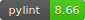

# koboldtrainingclub

[](https://codecov.io/gh/struandw/kobold-training-club)
[](https://app.travis-ci.com/github/struandw/kobold-training-club)


## Quickstart Guide
### Required Software
 - Python 3.8 or above
 - Git
 - NodeJS and NPM

### Initial Setup & Development Server
```bash
# clone the repo and cd into it
git clone https://github.com/struandw/kobold-training-club/
cd kobold-training-club

# install required python libraries
pip install -r requirements.txt

# install required js libraries
npm i

# cd into the main server source directory
cd ktc

# initialize / update sqlite db (creates / updates monsters.db in /data)
python converter.py

# start the development server
flask run
```

### Browserify JS Changes
```bash
cd static/js
browserify element_lister.js encounter-manager.js improved-initiative-service.js main.js party-manager.js sources-manager.js updater-button.js -o bundle.js
# Optionally, to automatically update bundle.js ```
watchify element_lister.js encounter-manager.js improved-initiative-service.js main.js party-manager.js sources-manager.js updater-button.js -o bundle.js &
```
